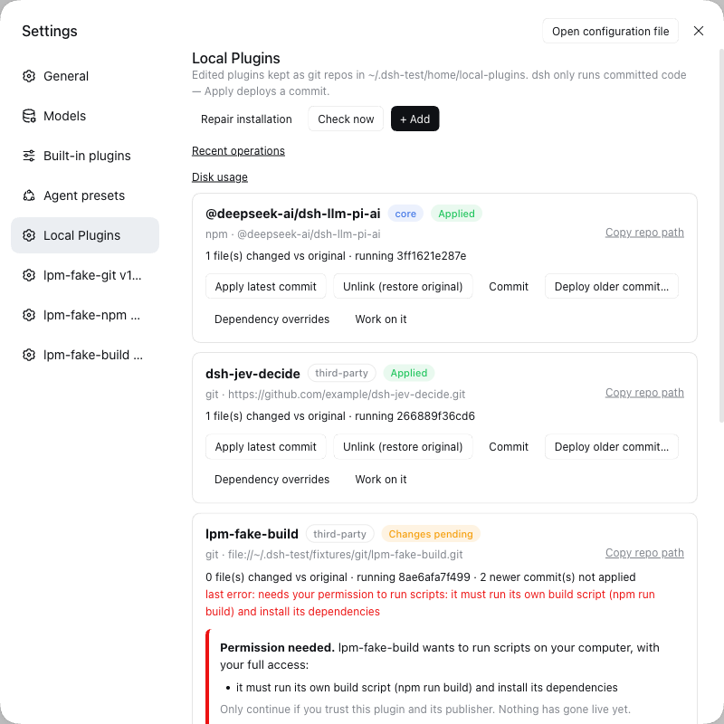
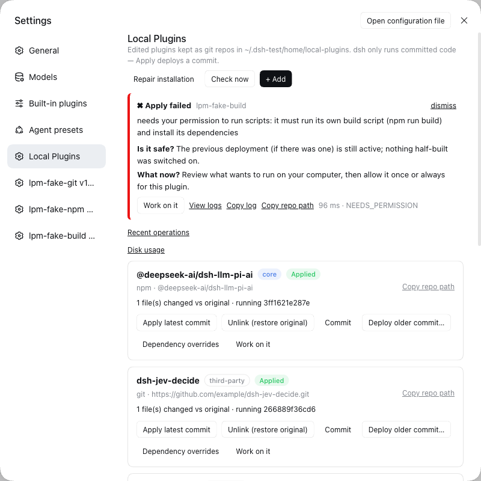
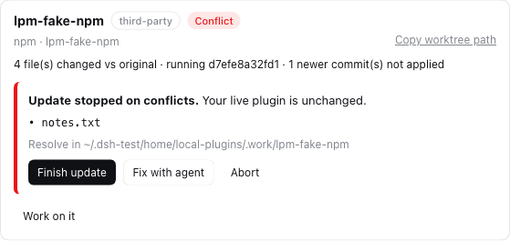
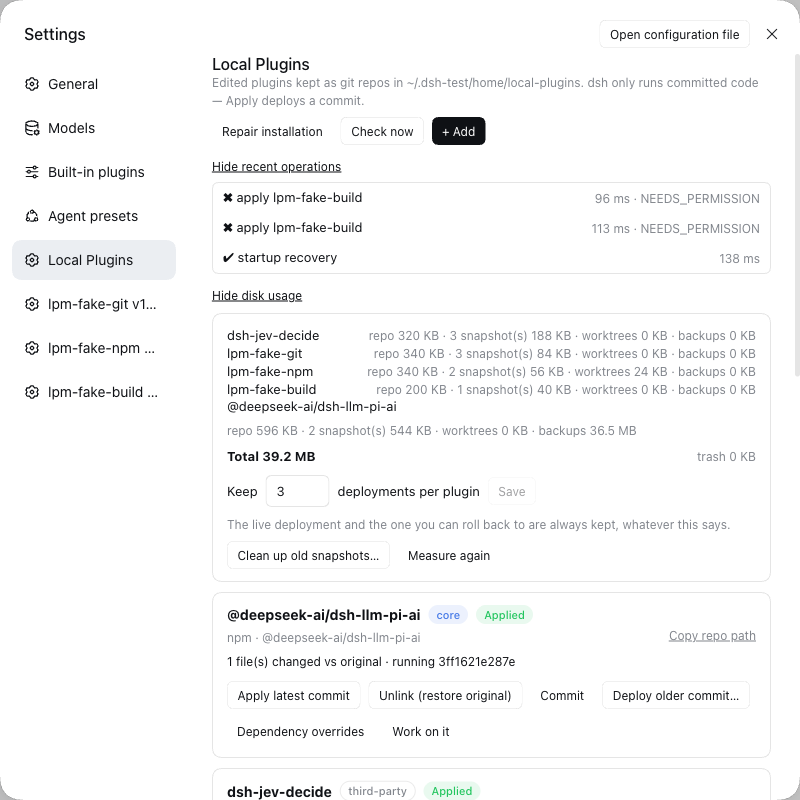
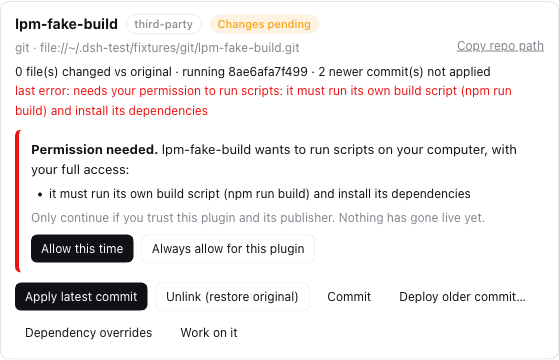

# dsh-local-plugins

[](https://github.com/ishanshmalviya5/dsh-local-plugins/actions/workflows/ci.yml)

**Customize any dsh plugin — even a built-in one — without losing your changes when things update, break or get reinstalled.**



## What you can do with it

| You want to… | You click | You get |
|---|---|---|
| **Fix or tweak a plugin and keep the fix** | **+ Add → Migrate**, edit, **Commit**, **Apply** | Your change runs in dsh and survives updates and reinstalls |
| **Take the author's new release without losing your tweaks** | **Update** | The new version *plus* your changes; if both touched the same lines you are asked, and nothing breaks meanwhile |
| **Go back** when a change misbehaves | **Deploy older commit…** | The earlier version, instantly |
| **Customize a built-in dsh feature** (for example a model provider) | the same steps, on a built-in plugin | Your version runs; **Unlink** gives the original back |
| **Let an AI agent change a plugin safely** | **Work on it** | An agent opens inside that plugin's folder with the context filled in; it can't switch anything on — only you can |
| **Recover after dsh was upgraded or reinstalled** | **Reapply all** | Your customizations are switched back on |
| **Try one exact version** | **+ Add**, `name@1.2.3` (or `…#v1.2.0`) | That version, and it stays put |
| **See what you changed versus the original** | look at the card | "3 files changed vs original", and what is running right now |
| **Stop customizing a plugin** | **Unlink**, then **Delete…** if you like | The original is back; your work is kept in a trash folder you can restore |
| **Keep your work somewhere else too** | it is an ordinary git folder: `~/.dsh/local-plugins/<plugin>` | add your own git remote and push |

And when something goes wrong, it tells you whether your setup is still safe and what to do next — it does not just say "failed".



## Install (2 minutes)

1. In a terminal (replace `web` with your profile name if you use another):
   ```bash
   dsh plugin --profile web add github:ishanshmalviya5/dsh-local-plugins
   ```
2. Restart dsh web.
3. Open **Settings → Local Plugins**.

You need `git`, `npm` and Node 26 or newer, on macOS or Linux ([details](#compatibility)).

## Your first customization

1. **+ Add → Migrate** and pick a plugin you already use. Anything you had already changed by hand is kept as your starting point.
2. Make your change — edit the files in `~/.dsh/local-plugins/<plugin>`, or press **Work on it** to have an AI agent do it with you.
3. **Commit**, then **Apply**, then restart dsh web.

That's the whole loop. Nothing changes in dsh until you click **Apply**, and if the new version can't be built or doesn't pass the checks, the old one simply keeps running.

## More stories

<details><summary><b>The author released a new version</b></summary>

Press **Check now** (it also checks shortly after dsh starts). A plugin with news shows **Update available**; click **Update**. Your changes and the new release are combined for you. If you and the author changed the same lines, the card lists those files and you choose: fix them (or press **Fix with agent**) and **Finish update**, or **Abort** to forget the attempt. Your running plugin is untouched throughout; you decide when to **Apply**.


</details>

<details><summary><b>A change made things worse</b></summary>

Click **Deploy older commit…** and pick the version that worked. If dsh itself starts misbehaving right after you applied something, it notices, puts the last working version back, and shows a message — your edits are saved for you to fix with **Work on it**.

If dsh won't start at all, run this in a terminal to put every original plugin back: `node ~/.dsh/local-plugins/.deployed/dsh-local-plugins/scripts/undo.mjs --all`
</details>

<details><summary><b>I'm customizing a built-in plugin and want out</b></summary>

**Unlink (restore original)** gives dsh the original, untouched plugin again. Your version stays listed (as **Not applied**), so you can switch it back on with **Apply** whenever you like.
</details>

<details><summary><b>I want to remove a plugin from the list</b></summary>

**Unlink** it first, then **Delete…** and type its name. Your work is moved to `~/.dsh/local-plugins/.trash/`, not erased. Move the folder back and press **Repair installation** to bring it back.
</details>

<details><summary><b>I don't know what state things are in</b></summary>

Press **Repair installation**. It looks for anything that doesn't add up (for example after a crash or a dsh upgrade), fixes what is safe, tells you about the rest, and never deletes your work. **Recent operations** shows what ran, how long it took, and the log; **Disk usage** shows space per plugin and lets you clean up old versions with a preview first.


</details>

<details><summary><b>Using an exact version</b></summary>

For npm plugins: `name`, `name@1.2.3` or `name@beta`. For plugins from git: a web address, `github:owner/repo` or `git@host:owner/repo`, optionally ending in `#v1.2.0` (a release), `#branch`, or `#commit`. A pinned release or commit never moves by itself.
</details>

## What the labels mean

| Label | Meaning | Do this |
|---|---|---|
| **Applied** | dsh is running your latest version | nothing |
| **Changes pending** | you have newer or uncommitted work that isn't running | **Commit**, then **Apply** |
| **Update available** | the author has a newer version | **Update** |
| **Conflict** | an update needs your decision about some files | **Finish update** or **Abort** |
| **Link lost** / **Reapply required** | dsh was upgraded or reinstalled | **Reapply all** (safe to repeat) |
| **Broken** | the records and the files disagree | **Repair installation** |
| **Disabled** | it crashed dsh and was taken out so dsh could start | **Work on it**, fix, **Commit**, **Apply** |
| **Not applied** | you track it, but dsh uses the normal plugin | **Apply** when you want yours |

## You stay in control

* **Scripts need your OK.** Some plugins want to run install or build scripts with your full access. That is off by default; you choose *Allow this time* or *Always allow for this plugin*, and it asks again if the publisher changes.
  
* **Your work is never silently lost.** Unlink, Delete, rollbacks and crash recovery all keep your edits somewhere you can get them back.
* **Only a finished, checked version is ever switched on** — never a half-done edit.
* **It only talks to the sources you track** (the plugin's git or npm origin).

How this is guaranteed: [Security](docs/security.md) · [Recovery](docs/recovery.md) · [How it works](docs/architecture.md).

## Compatibility — dsh-local-plugins 0.2.0

| Where | Status |
|---|---|
| macOS (Apple silicon), Node 26 | ✅ **Supported.** Tested by hand end to end against a real dsh, and in CI |
| Linux (Ubuntu), Node 26 | 🟡 Lint, all unit tests and package checks pass in CI. Not yet tried end to end against a real dsh |
| Linux, Node 22 / 24 | 🟡 Same CI results, but outside the supported range (needs Node 26 or newer) |
| Windows | ❌ Not supported — it says so and doesn't start |

Built and tested against **dsh 0.2.0-rc.2**. Upgrading from version 0.1 needs nothing from you: your plugins stay exactly as they are (details in the [CHANGELOG](CHANGELOG.md)).

## Good to know

* If a plugin crashes dsh *before* this one loads, it can't repair that itself — use the `undo.mjs` command above.
* The check before going live confirms the files are complete and readable; it does not run the plugin first.
* Built-in plugins follow the version that ships with your dsh, not newer npm releases.
* It does one thing at a time; if you click while it is busy, it asks you to wait.

## For developers

[HTTP API](docs/api.md) · [Status rules](docs/state-machine.md) · [Troubleshooting](docs/troubleshooting.md) · [Performance](docs/performance.md) · [Release checklist](docs/release-checklist.md) · [Developing](docs/development.md)

Contributions are welcome, including AI-assisted ones: read [CONTRIBUTING.md](CONTRIBUTING.md) first (and [AGENTS.md](AGENTS.md) for coding agents).

## License

MIT — see [LICENSE](LICENSE).
